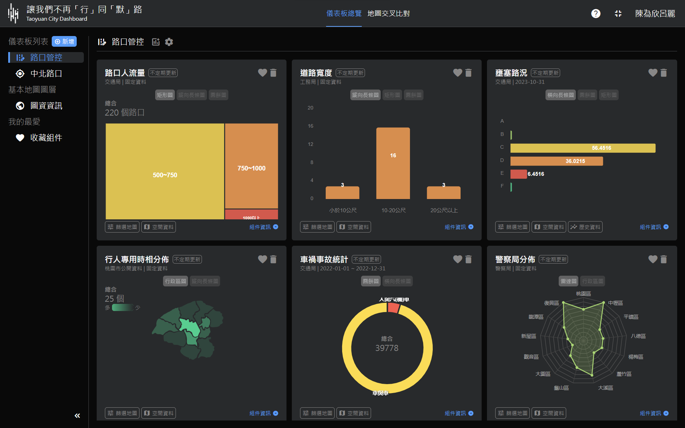
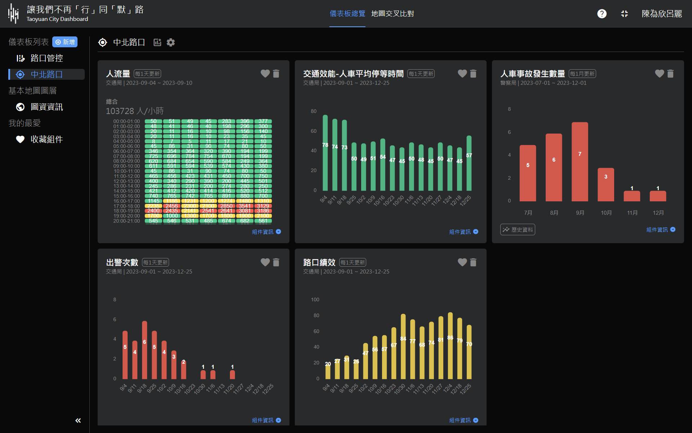
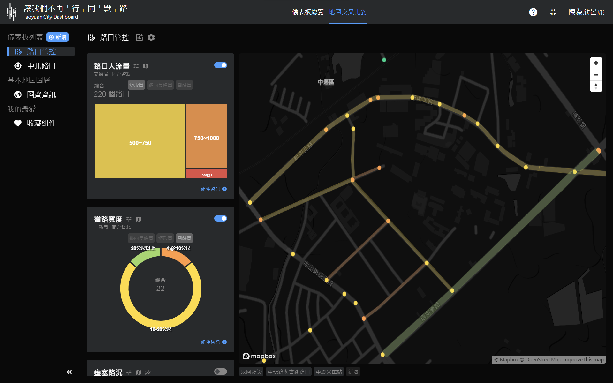
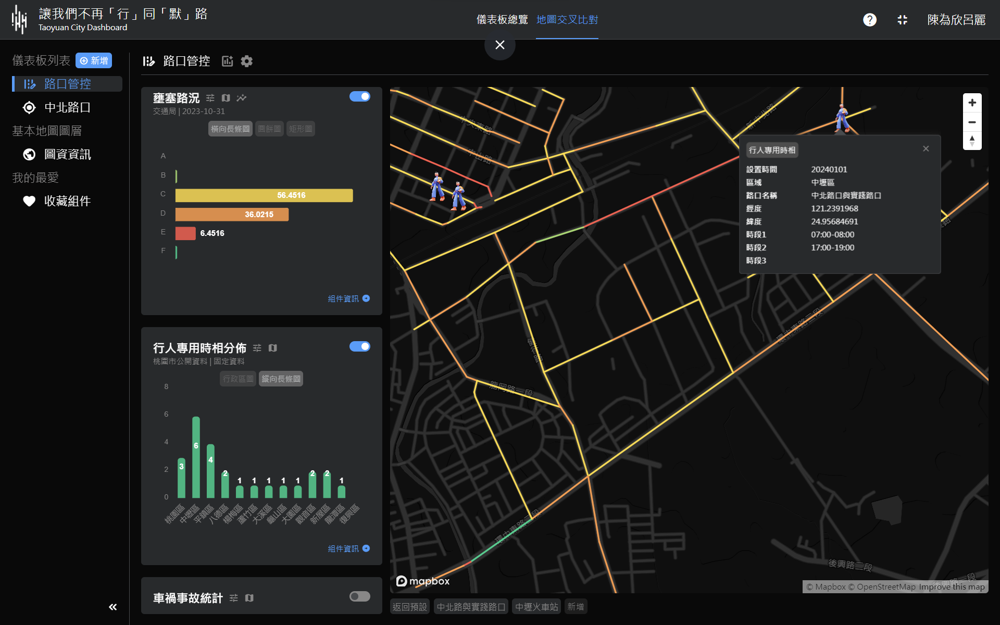
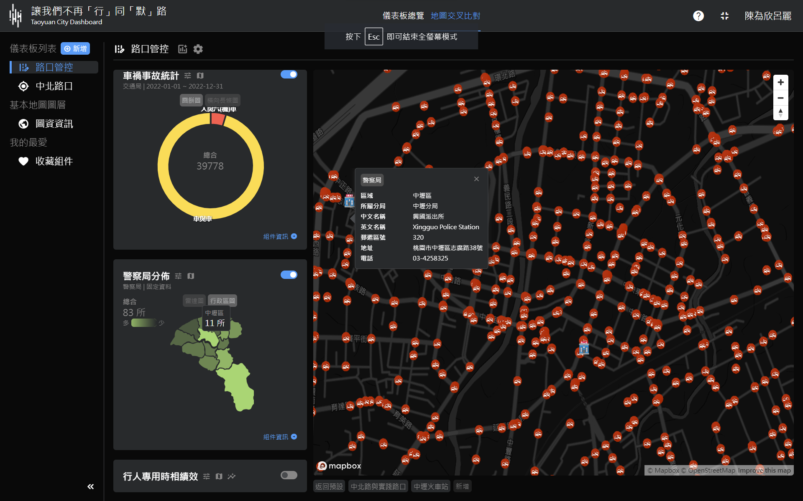
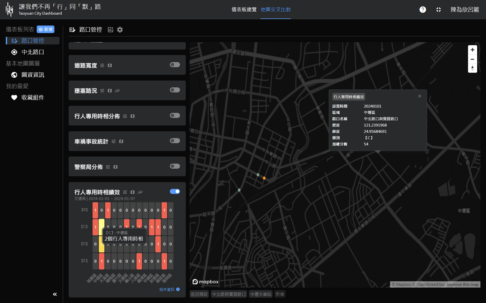
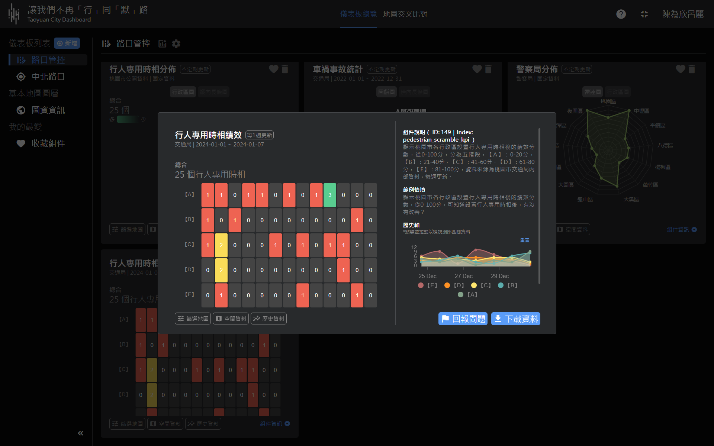

#   Taiyuan City Dashboard 桃園城市儀表板
## 主題：讓我們不再「行」同「默」路

### 1. 本戰情中心希望解決的智慧城市問題
在2021年，臺灣的交通問題引起國際關注，更被國際媒體稱為「行人地獄」。政府回應這一問題的政策之一是推動行人專用時相。因為行人專用時相將人流及車流分開，不僅僅可以降低事故率，還可以讓右轉車不需要等待行人通行，確保交通效率。然而，截至2023年，身為六都之一的桃園市行人專用時相數量仍然偏低。為了改變這一現象，我們提出了一個智慧城市解決方案，致力於提升交通安全性並優化交通流動。
### 2. 解決方式
解決方式旨在改善智慧城市中的行人安全問題與交通問題，特別針對行人專用時相的設置地點、開啟時段與秒數調整。我們透過預測、處理與績效三大子系統的整合來提高交通效能和行人安全性，並將數據分析視覺化，以優化決策者的使用體驗與效率。

#### 2.1. 層級式儀表板：允許決策者在總體上查看所有路口的總體概要數據[路口管控]；同時也提供深入到單一路口[中北路口]的能力，以便進一步分析和了解細節。
#### 2.2. 行人專用時相設置與時段：透過儀表板中的［人流量］和［壅塞路段(車流)］因素判斷是否需要在特定路口與特定時間設置行人專用時相。考慮到 [道路寬度]，我們確保行人能夠安全穿越。根據桃園市政府資料開放平台與施政方針、我們在中原大學周遭的親身觀察、儀表板提供的數據、各項新聞內容等等，我們選擇實作在［中北路、實踐路口］進行行人專用時相的路口範例。
#### 2.3. 紅綠燈秒數調整：為確保車輛和行人之間的交通協調，我們透過數據分析和設置來調整紅綠燈時間。而行人專用時相最主要的服務對象為「行人」，因此我們將會以 [人流量] 數據為主，其餘為輔作為設置紅綠燈秒數的基準。
#### 2.4. 績效評估：安裝行人專用時相後，我們持續監測 [中北路口] 的績效。這包括人車事故的減少、交通效能的改善和派警次數的降低。如果路口的績效指標在設置行人專用時相後有明顯改善，則代表我們的解決方案取得成功。


 
 
 
 
 
 
 


## Quick Start

### Docker

1. Install [Docker](https://www.docker.com/products/docker-desktop/) on your computer and start running it.
2. Fork this repository then clone the project to your computer. Execute `pwd` (mac) or `cd` in the repository terminal to get the complete path.
3. Execute the following command in the system terminal and replace "<repository path>" with the path you got in step 2.

```bash
docker run -v <repository path>:/opt/Taipei-City-Dashboard-FE -p 80:80 -it node:18.18.1-alpine3.18  sh
```

4. Execute the following commands to enter the project folder and install packages.

```bash
cd /opt/Taipei-City-Dashboard-FE
npm install
```

5. You should now be able to locally host this project by executing `npm run dev` in the respository terminal.
6. Refer to the [Docs](https://tuic.gov.taipei/documentation/front-end/project-setup) to complete further configurations.

### Local Environment

1. Download [Node.js](https://nodejs.org/en) on your computer.
2. Fork this repository then clone the project to your computer.
3. Execute `npm install` in the respository terminal
4. You should now be able to locally host this project by executing `npm run dev` in the respository terminal.
5. Refer to the [Docs](https://tuic.gov.taipei/documentation/front-end/project-setup) to complete further configurations.

## Documentation
Develop Taoyuan City Dashboard based on Taipei City Dashboard.
Check out the complete documentation for Taipei City Dashboard FE [here](https://tuic.gov.taipei/documentation).
